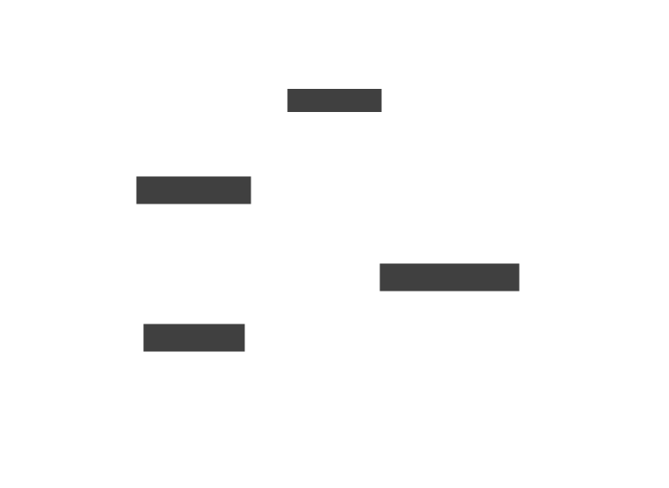

# Skeleton of Thought

<details>
<summary>How to run this example</summary>
<br/>

```bash
# Set your API key as an environment variable.
export SUBSTRATE_API_KEY=ENTER_YOUR_KEY

# Run the TypeScript example

# If using tsx:
cd typescript                   # Navigate to the typescript example
npm install                     # Install dependencies
npx tsx example.ts              # Run the example

# If using Deno:
cd typescript
deno run example.ts

# Run the Python example

# If using Poetry:
cd python                       # Navigate to the python example
poetry install                  # Install dependencies and build the example
poetry run main                 # Run the example

# If using Rye:
# Update pyproject.toml to switch to Rye.
cd python
rye sync
rye run main
```

</details>

We follow this procedure to create consistent, high volume content.

1. Come up with a short readable slug, e.g. `generate-json` and a title.
2. Create a folder in the [examples repo](https://github.com/SubstrateLabs/examples), copying this folder
3. Write the code in TS or Python, and keep it simple. Ideally it’s just a script with no additional dependencies.
   1. Consider creating illustrative variations of the script (e.g. `ComputeText` and `MultiComputeText` - [example](https://github.com/SubstrateLabs/examples/tree/main/basics/generate-text))
   2. Translate your script to the other language. (TODO: automated translation with Substrate)
   3. Make sure both examples run and produce simple polished output.
   4. Simplify the code
      1. Wrap lines (multi-line node declarations are easier to read)
      2. Consider inlining variables
4. Fill out this README with walkthrough text and generate new image assets.


To generate text with an LLM, use [`ComputeText`](https://www.substrate.run/nodes#ComputeText).

In the code snippets below, note how we've simplified the example code to:

- Use a hardcoded API key, rather than reading from an environment variable.
- Remove the main function
- Combine getting the result of a node and printing it

Try your best to limit extraneous content in both text and code.

```python Python
# example.py
from substrate import Substrate, ComputeText

substrate = Substrate(api_key="YOUR_API_KEY")

story = ComputeText(prompt="tell me a short 2-sentence story")
res = substrate.run(story)

print(res.get(story).text)
```

```typescript TypeScript
// example.ts
import { Substrate, ComputeText } from "substrate";

const substrate = new Substrate({ apiKey: "YOUR_API_KEY" });

const story = new ComputeText({ prompt: "tell me a short 2-sentence story" });
const res = await substrate.run(story);

console.log(res.get(story).text);
```

When you're done, generate some images. You'll need a banner image.

- For the text, keep it simple, e.g. you can just use the name of a node: `ComputeText`.

```bash
cd _internal
poetry run marimo edit marketing.py
```

If your example is a graph, create a diagram.



To edit the diagram, run:

```bash
d2 -w diagram.d2 diagram.svg
```
